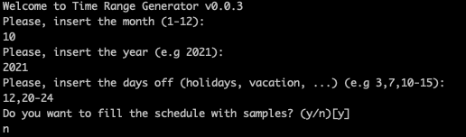
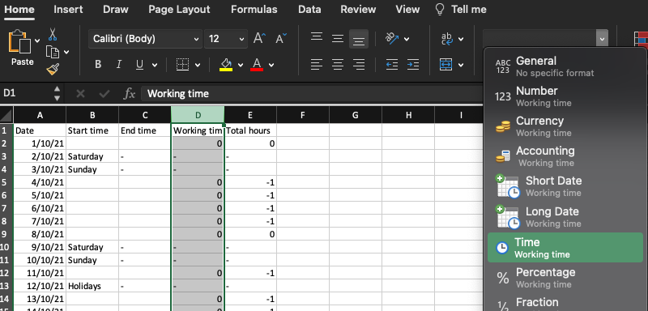
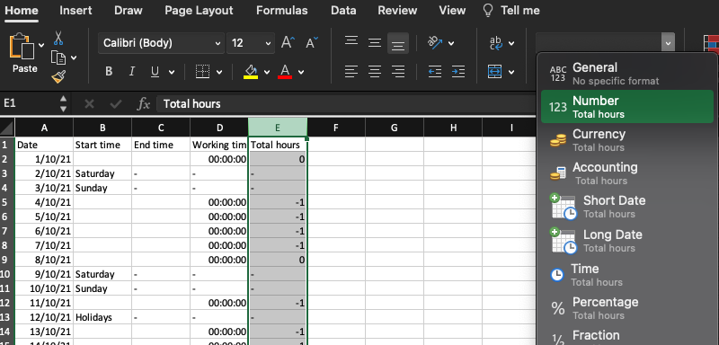

# Time Range Generator

TimeRangeGenerator is a tool to generate a template for time control.

## How it works?

Run the tool and answer the questions.

- **Please, insert the month (1-12):**
- **Please, insert the year (e.g 2021):**
- **Please, insert the days off (holidays, vacation, ...) (e.g 3,7,10-15):** you can separate the days by comma and also, add range with `-`.
- **Do you want to fill the schedule with samples? (y/n)[y]** do you want empty template or filled by samples?
- **Please, insert your start time in float format (8.5) (e.g 8:30 = 8.5, 9:15 = 9.25)[8.5]:** if you want to fill the template with samples, you must insert your start time in float format. For example, 08:30 (half past eight) is equal to 8.5 and so on.

After generating the template, **you have to change the format of column D to Time and column E to Number**. And finally, save the file in Excel format (xlsx).

### Save Working time (column D) as Time.

### Save Total hours (column E) as Number.

**Important:** Remember to save the file in Excel format (xlsx).
